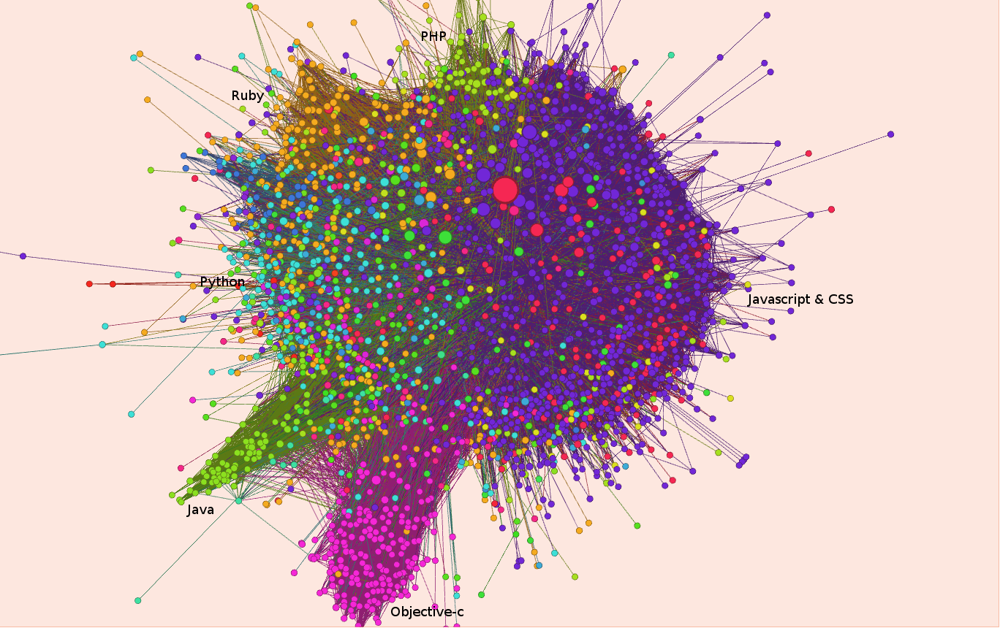

#### Course Project of Social Network Analysis on Coursera

This is the course project of SNA on Coursera, completed on 24th, Nov. 2014.

This work mainly analyzes the network of GitHub users' interest towards repositories, with repositories being the nodes, and the count of users that have starred both of the repositories being the edges.
The Analysis focuses not only snapshots of such networks from January 2012 to October 2014, but also looks into the overall trend of the network evolution, as well as certain nodes' change in popularity.

This repository contains all the data, scripts necessary for this report, and the report itself.

One can use the sql files in bigquery/ to conduct trial queries on Google BigQuery.
For data collection purposes, script data_batch/generate_queries.py should be run and each of the generated query files should be manually copied to bigquery to collect data.

The data I collected are available in data/ .

To obtain gdf files for Gephi, as well as ncol files for igraph computation, please use convert_csv_to_graph_files.sh .

To obtain computational data, please use caculate_data.py .

Attaching a snapshot of Y14Q2 network.

Have fun!

Cheers,

Jiacheng Pan [jiacheng.pan.sh@gmail.com](mailto:jiacheng.pan.sh@gmail.com)

